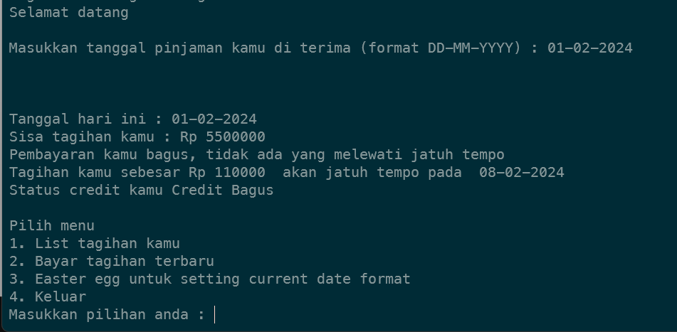

# Loan Scheduler Service
This is the tutorial to run the service

## Installation
Install the dependencies : 
```sh
go mod tidy
```

## Run The Service
```sh
go run main.go loan.go
```

## Run The Test
```sh
go test
```

## Example Program


Thanks  
-Adhika Aryantio-
